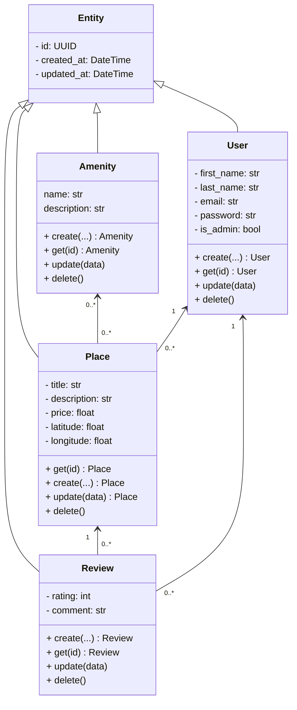

```mermaid
---
config:
  layout: dagre
---
classDiagram
direction BT
    class Entity {
	    - id: UUID
	    - created_at: DateTime
	    - updated_at: DateTime
    }

    class User {
	    - first_name: str
	    - last_name: str
	    - email: str
	    - password: str
	    - is_admin: bool

	    + create(...) User
        + get(id) User
        + update(data)
        + delete()
    }

    class Place {
	    - title: str
	    - description: str
	    - price: float
	    - latitude: float
	    - longitude: float

        + get(id) Place
        + create(...) Place
        + update(data) Place
        + delete()
    }

    class Review {
	    - rating: int
	    - comment: str
        + create(...) Review
        + get(id) Review
        + update(data)
        + delete()
    }

    class Amenity {
	    name: str
	    description: str
        + create(...) Amenity
        + get(id) Amenity
        + update(data)
        + delete()
    }

    Amenity --|> Entity
    User --|> Entity
    Place --|> Entity
    Review --|> Entity
    Place "0..*" --> "0..*" Amenity
    Review "0..*" --> "1" Place
    Review "0..*" --> "1" User
    Place "0..*" --> "1" User
```
