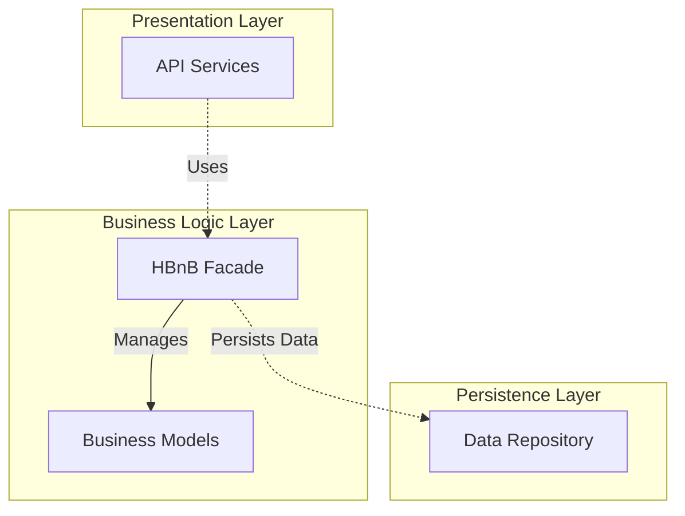

```mermaid
graph TD
    subgraph Presentation_Layer [Presentation Layer]
        API[API Services]
    end

    subgraph Business_Logic_Layer [Business Logic Layer]
        Facade[HBnB Facade]
        Models[Business Models]
    end

    subgraph Persistence_Layer [Persistence Layer]
        Repo[Data Repository]
    end

    
        API -.->|Uses| Facade
    
    Facade -->|Manages| Models
    
    Facade -.->|Persists Data| Repo
```
