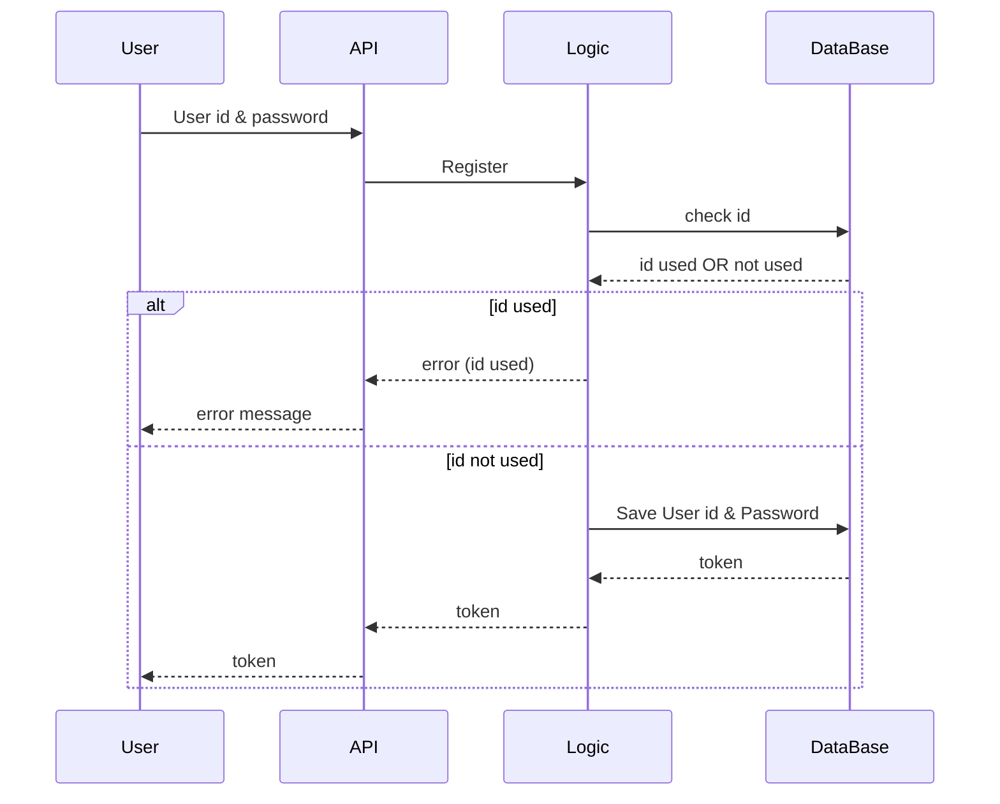
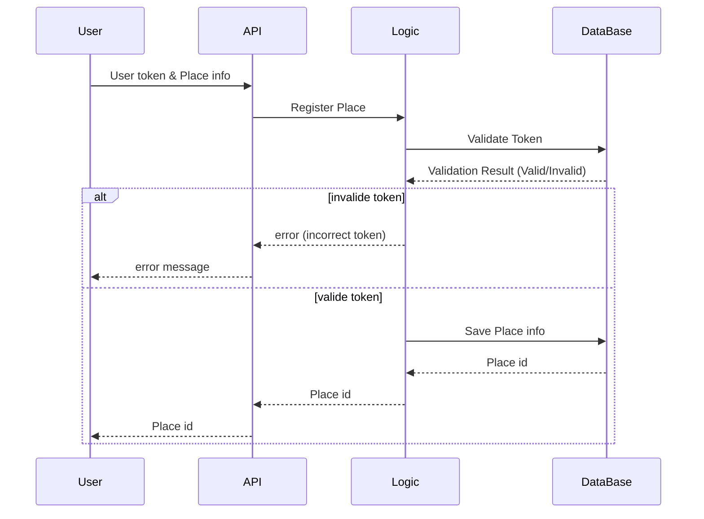
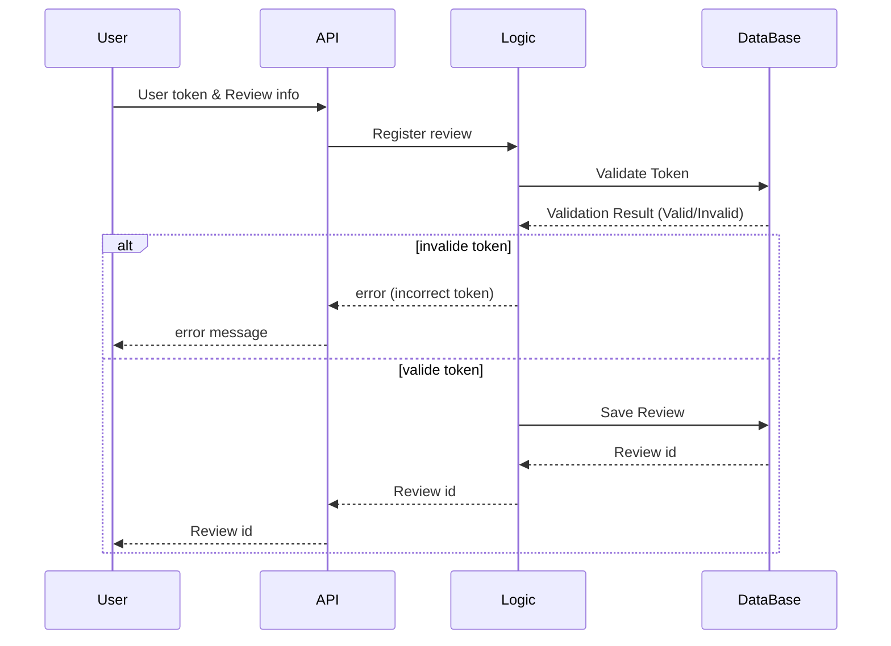
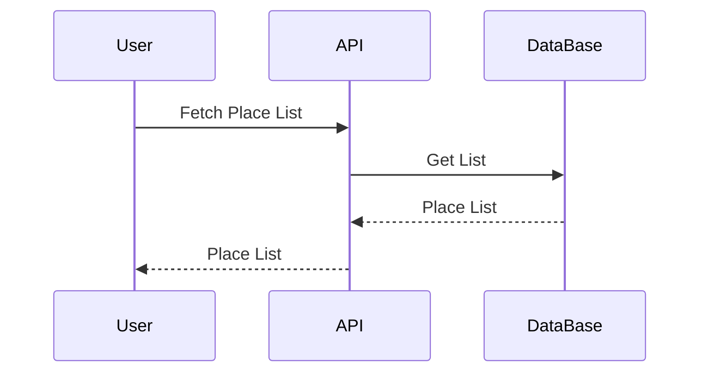

### Register User 

```mermaid
sequenceDiagram
    participant User as User
    participant API as API
    participant Logic
    participant DB as DataBase

    User->>API: User id & password
    API->>Logic: Register

    Logic->>DB: check id
    DB-->>Logic: id used OR not used

    alt id used
        Logic-->>API: error (id used)
        API-->>User: error message
    else id not used
        Logic->>DB: Save User id & Password
        DB-->>Logic: token
        Logic-->>API: token
        API-->>User: token
    end
```

### Register Place

```mermaid
sequenceDiagram
    participant User as User
    participant API as API
    participant Logic
    participant DB as DataBase

    User->>API: User token & Place info
    API->>Logic: Register Place

    Logic->>DB: Validate Token
    DB-->>Logic: Validation Result (Valid/Invalid)

    alt invalide token
        Logic-->>API: error (incorrect token)
        API-->>User: error message
    else valide token
        Logic->>DB: Save Place info
        DB-->>Logic: Place id
        Logic-->>API: Place id
        API-->>User: Place id
    end
```

### Register review

```mermaid
sequenceDiagram
    participant User as User
    participant API as API
    participant Logic
    participant DB as DataBase

    User->>API: User token & Review info
    API->>Logic: Register review

    Logic->>DB: Validate Token
    DB-->>Logic: Validation Result (Valid/Invalid)

    alt invalide token
        Logic-->>API: error (incorrect token)
        API-->>User: error message
    else valide token
        Logic->>DB: Save Review
        DB-->>Logic: Review id
        Logic-->>API: Review id
        API-->>User: Review id
    end
```

### Fetch place

```mermaid
sequenceDiagram
    participant User as User
    participant API as API
    participant DB as DataBase

    User->>API: Fetch Place List

    API->>DB: Get List

    DB-->>API: Place List

    API-->>User: Place List
```