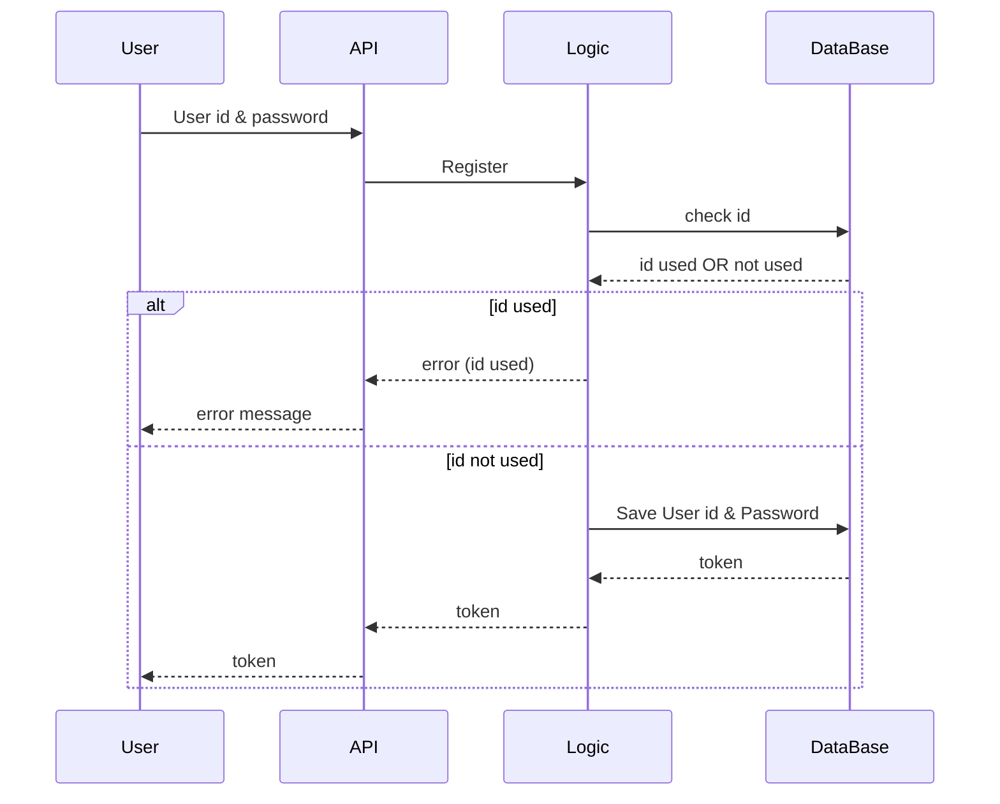

```mermaid
sequenceDiagram
    participant User as User
    participant API as API
    participant Logic
    participant DB as DataBase

    User->>API: User id & password
    API->>Logic: Register

    Logic->>DB: check id
    DB-->>Logic: id used OR not used

    alt id used
        Logic-->>API: error (id used)
        API-->>User: error message
    else id not used
        Logic->>DB: Save User id & Password
        DB-->>Logic: token
        Logic-->>API: token
        API-->>User: token
    end
```
