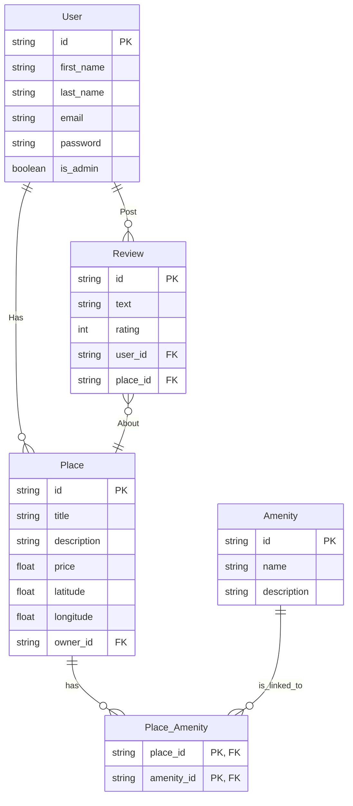

# HBnB - Part 3 : SQLAlchemy Persistence

REST API for the HBnB application built with Flask and Flask-RESTx.
This part persists entities with SQLAlchemy instead of keeping everything in memory.

## Architecture

```
part3/
├── app/
│   ├── api/v1/          # Endpoints (users, amenities, places, reviews)
│   ├── models/          # SQLAlchemy models + validation
│   ├── persistence/     # SQLAlchemy repositories regrouped in one module
│   └── services/        # Facade pattern
├── run.py
└── requirement.txt
```

## Installation

```bash
pip install -r requirement.txt
```

## Run the server

```bash
python run.py
```

API available at: `http://localhost:5000/api/v1/`
Swagger UI available at: `http://localhost:5000/`

## Endpoints

| Method | Endpoint | Description |
|---|---|---|
| GET/POST | `/api/v1/users/` | List all users / Create a user |
| GET/PUT | `/api/v1/users/<id>` | Get / Update a user |
| GET/POST | `/api/v1/amenities/` | List all amenities / Create an amenity |
| GET/PUT | `/api/v1/amenities/<id>` | Get / Update an amenity |
| GET/POST | `/api/v1/places/` | List all places / Create a place |
| GET/PUT | `/api/v1/places/<id>` | Get / Update a place |
| GET/POST | `/api/v1/reviews/` | List all reviews / Create a review |
| GET/PUT/DELETE | `/api/v1/reviews/<id>` | Get / Update / Delete a review |
| GET | `/api/v1/reviews/by_place/<id>` | Get all reviews for a place |

## Tests

All tests use Python's `doctest` module and must be run from the `part3/` directory.

```bash
# Models
python3 -m doctest app/models/tests.txt

# Facade (business logic)
python3 -m doctest app/services/tests_facade.txt

# API endpoints
python3 -m doctest app/api/v1/tests.txt
```


> **Note:** User, Place, Review and Amenity are now stored in the SQLite database configured in [config.py](config.py).



