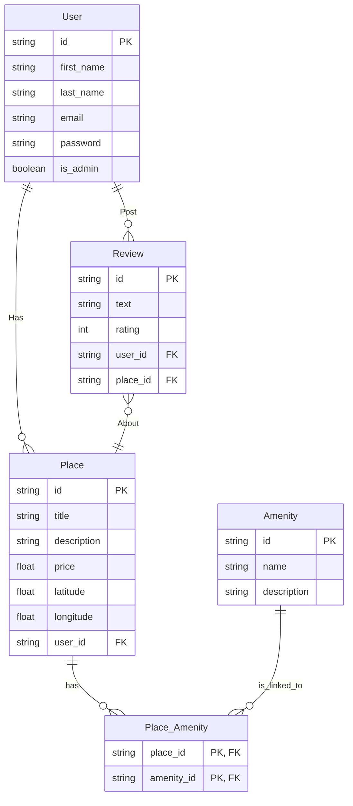

# HBnB - Part 4 : Full-stack Backend

REST API for the HBnB application built with Flask, Flask-RESTx, and SQLAlchemy.
This version serves as the backend for the Part 4 full-stack application, providing persistent data storage and authentication via JWT.

## Architecture

```text
part4/hbnb-backend/
├── app/
│   ├── api/v1/          # Endpoints (users, amenities, places, reviews, auth)
│   ├── models/          # SQLAlchemy models + validation
│   ├── persistence/     # SQLAlchemy repositories
│   └── services/        # Facade pattern
├── instance/            # SQLite database files
├── config.py            # Configuration settings
├── run.py               # Entry point
├── schema.sql           # SQL script to create tables
├── seed.sql             # SQL script to populate database with admin
├── sample_data.sql      # SQL script to populate database with sample data
└── requirement.txt      # Dependencies
```

## Features

- **SQLAlchemy Persistence:** Entities (Users, Places, Reviews, Amenities) are persisted in a SQLite database.
- **Authentication:** JWT-based authentication for secure access to endpoints.
- **CORS Support:** Enabled to allow communication with the frontend application.
- **Validation:** Business logic and data validation via a Facade pattern.

## Installation

```bash
git clone https://github.com/ylabate/holbertonschool-hbnb.git
cd holbertonschool-hbnb/part4/hbnb-backend
pip install -r requirement.txt
```

## Initialize the Database

```bash
mkdir instance
cat schema.sql | sqlite3 instance/development.db
cat seed.sql | sqlite3 instance/development.db
cat sample_data.sql | sqlite3 instance/development.db
```

## Run the Server

```bash
python run.py
```

- API Base URL: `http://localhost:5000/api/v1/`
- Swagger UI (Documentation): `http://localhost:5000/`

## Endpoints

| Method | Endpoint | Description |
|---|---|---|
| POST | `/api/v1/auth/login` | Authenticate user and return a JWT token |
| GET | `/api/v1/users/` | List all users (Admin only) |
| GET/PUT | `/api/v1/users/<id>` | Get / Update a user |
| GET/POST | `/api/v1/amenities/` | List / Create amenities |
| GET/POST | `/api/v1/places/` | List / Create places |
| GET/PUT/DELETE | `/api/v1/places/<id>` | Get / Update / Delete a place |
| GET/POST | `/api/v1/reviews/` | List / Create reviews |
| GET/PUT/DELETE | `/api/v1/reviews/<id>` | Get / Update / Delete a review |
| GET | `/api/v1/reviews/by_place/<id>` | Get all reviews for a place |

## Tests

Run tests from the `part4/hbnb-backend/` directory:

```bash
# Models
python3 -m doctest app/models/tests.txt

# Facade (business logic)
python3 -m doctest app/services/tests_facade.txt

# API endpoints
python3 -m doctest app/api/v1/tests.txt
```


